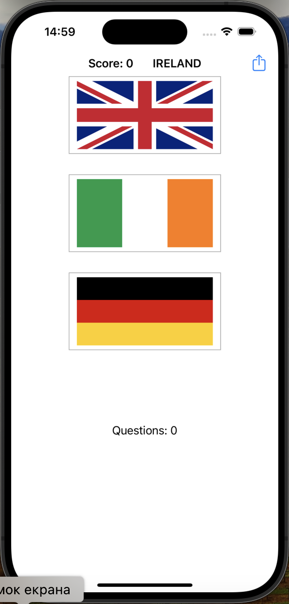

# Project2

Project2 is a simple quiz app that tests the user's knowledge of different countries.

## Table of Contents

* [Features](#features)
* [Screenshots](#screenshots)
* [Requirements](#requirements)
* [Usage](#usage)
* [Code Overview](#code-overview)

## Features

* Displays a list of questions and their corresponding answers
* Allows users to answer questions and track their score
* Includes a share feature to share the user's score

## Screenshots

  
   
  <em>Guess Flag Screen</em>

## Requirements

* iOS 12.0+
* Xcode 12.0+
* Swift 5.0+

## Usage

1. Launch the app.
2. You will need to select the right flag of the country.
3. Tap on the correct answer to increase your score.
4. The app will continue to ask questions until you have answered 10 questions.
5. After answering 10 questions, you can view your final score and play again.

## Code Overview

### ViewController

* Manages the list of questions and their corresponding answers.
* Handles user interactions, such as answering questions and tracking their score.
* Includes a share feature to share the user's score.
